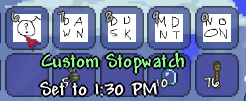

# BrokenStopwatches #

## Why Did You Make This? ##

1. I wanted to learn C#, but I can really only push myself to program when I have a clear project in mind.  
2. I remembered tModLoader uses C#.  
3. When playing Terraria with my brothers, we would just change the time using commands, so I thought a mod would be better.  

## How do I get it? ##

1. Download the entire repo (Look for green `Code` download button). Download ZIP. Unzip into one folder called "BrokenStopwatches".
Move folder into .../Terraria/ModLoader/Mod Sources/  
2. Go into tModLoader game, click on `Developer` in the bottom right. Go to `Mod Sources` menu item. Click `Build and Reload` on BrokenStopwatches.  
3. You're done!

## What's in it? ##

So far it's got 5 items:

* Basic Stopwatches:
  * Dawn (4:30 AM)
  * Noon (12:00 PM)
  * Dusk (7:30 PM)
  * Midnight (12:00 AM)
* Custom Stopwatch
  * Can be set to any time you choose. (tModLoader note: used `save` and `load` functions, but I'm not totally confident in my implementation. Send advice if you have any!)

## How do the Items Work? ##

All Stopwatches: Left-click to set the world time to the time specified. Ex: When holding the Dawn Stopwatch, left-click and the world will be set to 4:30 AM.  
Custom Stopwatch: Right-click to set its time. It will display a debug message in the chat. Left-click to set the world time just like all other Stopwatches.  
Note: You can find what time exactly each Stopwatch is set to by looking at its tooltip; this is especially useful with the Custom Stopwatch when you don't want to overwrite it or change the world time.  

